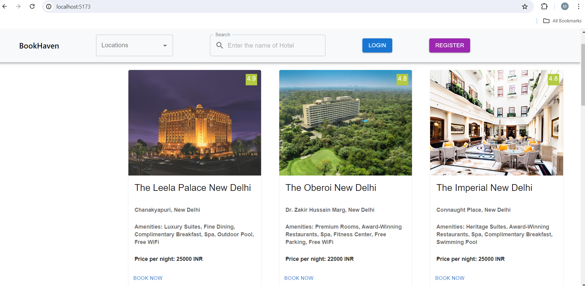
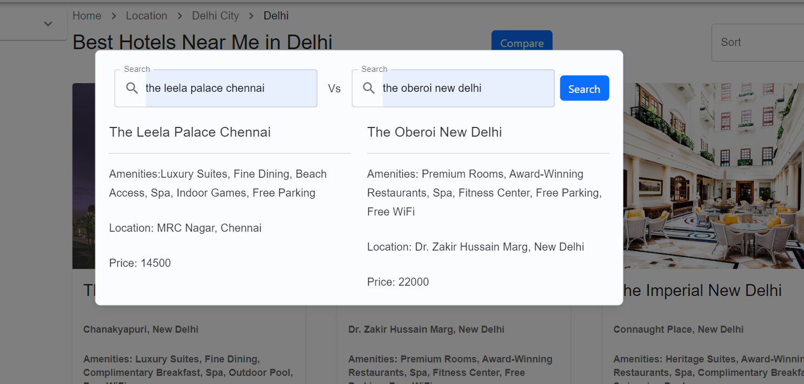
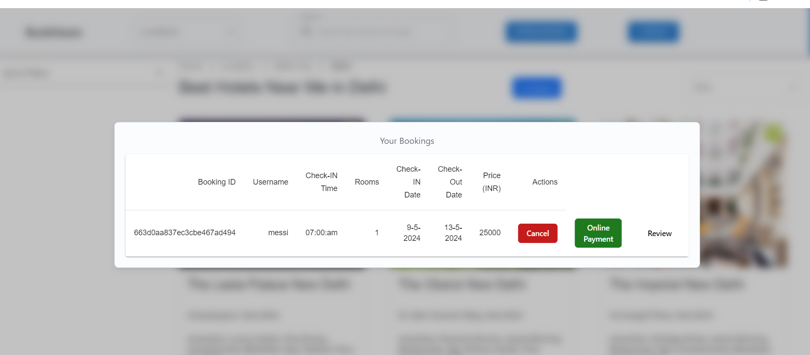
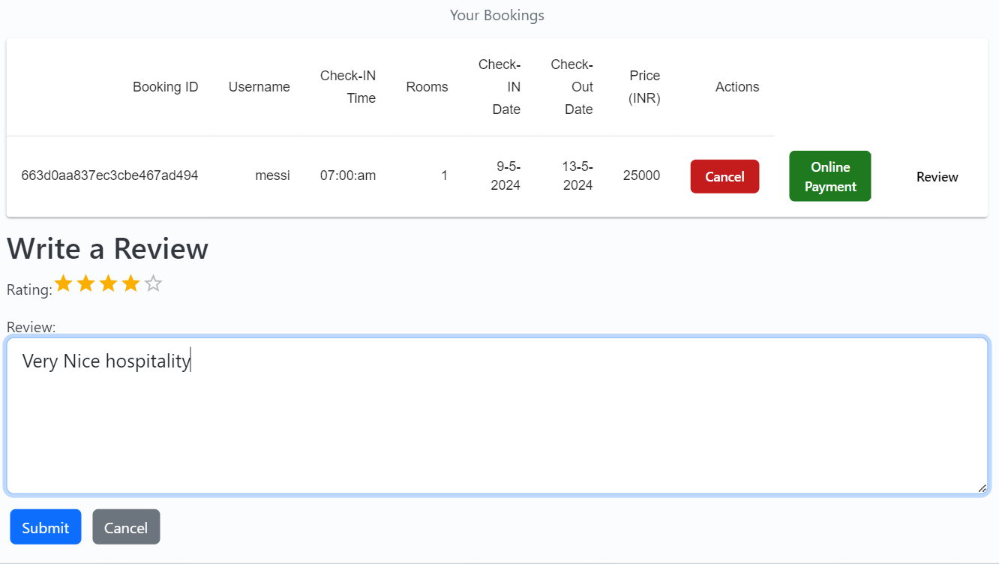

# Project Title :  Hotel booking App

## objective:

- Design and develop an Application using the full-stack.

## Design Phase:

 - Sketch the layout of your application’s interface, focusing on usability and user experience. Use CSS frameworks like Bootstrap for a responsive design that adapts to various screen sizes.

 ## Tech Stacks:

- Front-end: Reactjs 
- Back-end: Nodejs
- Database: MongoDB

## Backend Development:

- Set up Node.js and Express.js for creating RESTful APIs to handle requests and responses.

- Use MongoDB for storing and managing tasks, user data, and authentication details.

- Implement JWT, and Bcrypt for secure access.

- Integrate middleware for user permissions and role-based access control.

 ## Functionality Development:

- Users can view all hotel details including hotel name, price, amenities ,location.    

- Users can search for hotels using the application, providing them with a variety of options based on their preferences.

---------------------------------------------------------------------------

- The app allows users to compare the prices of different hotels, ensuring they find the best deal for their stay using individual components. 

---------------------------------------------------------------------------

- List all view all the booking logs on individual components

- Users can easily reserve hotels and manage their bookings directly within the application.

-------------------------------------------------------------

- Secure payment processing functionality is integrated into the app(by online payment button for payment), ensuring that users can make payments for their bookings conveniently and safely (RazorPay Payment integration).

----------------------------------------------------------------

- Users can leave reviews and ratings for hotels they have stayed at, helping others make informed decisions when booking.

---------------------------------------------------------------